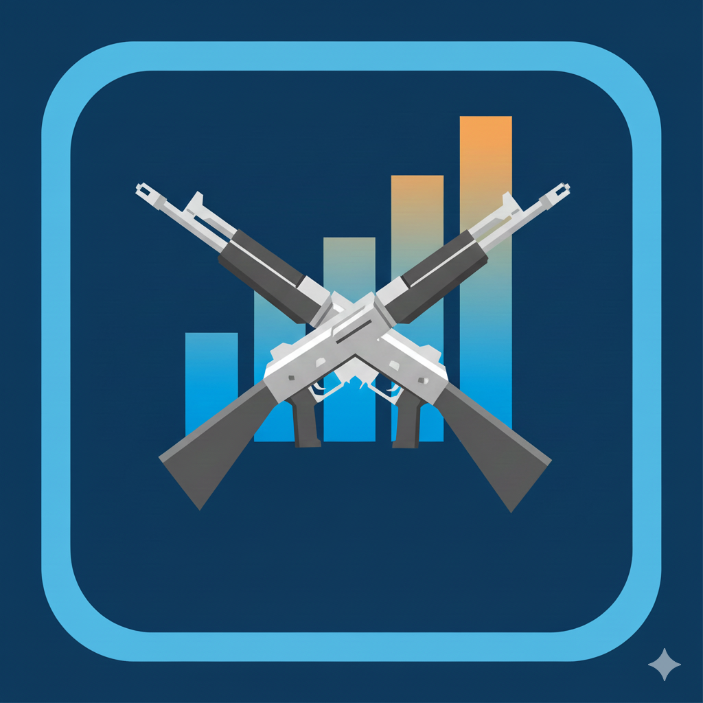

<p align="center">
  
</p>

[](https://github.com/KernelPryanic/csstatstracker)
[](https://opensource.org/licenses/MIT)

# CS Stats Tracker

A Counter-Strike statistics tracker built with Go and Fyne for manually tracking CT vs T round wins.

## Features

- Side-by-side counters with color-coded displays (CT blue, T orange)
- Configurable game score target (default: 8)
- Global hotkeys that work system-wide
- Sound effects for score changes
- SQLite database for game history

## Installation

Download the latest release for your platform from [Releases](../../releases).

### Build from source

**Linux (Fedora)**
```bash
sudo dnf install gcc libX11-devel libXcursor-devel libXrandr-devel libXinerama-devel libXi-devel libGL-devel libXxf86vm-devel libXtst-devel alsa-lib-devel
go build -o csstatstracker ./cmd/
```

**Linux (Ubuntu/Debian)**
```bash
sudo apt-get install gcc libgl1-mesa-dev xorg-dev libxtst-dev libasound2-dev
go build -o csstatstracker ./cmd/
```

**Windows (cross-compile from Linux)**
```bash
go install github.com/fyne-io/fyne-cross@latest
fyne-cross windows -arch=amd64 ./cmd/
```

## Default Hotkeys

| Action | Linux | Windows |
|--------|-------------|---------|
| CT +1 | Numpad1 + NumpadAdd | 1 + + |
| CT -1 | Numpad1 + NumpadSubtract | 1 + - |
| T +1 | Numpad2 + NumpadAdd | 2 + + |
| T -1 | Numpad2 + NumpadSubtract | 2 + - |
| Reset | Numpad0 + NumpadEnter | 0 + Enter |
| Select CT | Ctrl + C | Ctrl + C |
| Select T | Ctrl + T | Ctrl + T |
| Swap Teams | NumpadDecimal + NumpadEnter | . + Enter |

All hotkeys can be customized in **Settings**.

## Configuration

- Settings stored in `csstatstracker.json`
- Game history stored in `csstatstracker.db`
