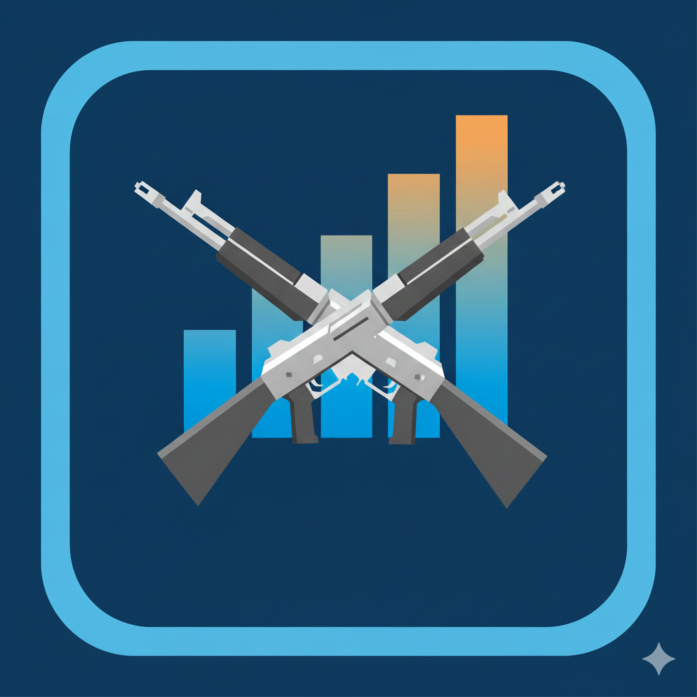

<p align="center">
  
</p>

[](https://github.com/KernelPryanic/csstatstracker)
[](https://opensource.org/licenses/MIT)

# CS Stats Tracker

A Counter-Strike statistics tracker built with Go and Fyne for manually tracking CT vs T round wins.

## Features

- Side-by-side counters with color-coded displays (CT blue, T orange)
- Configurable game score target (default: 8)
- Global hotkeys that work system-wide
- Sound effects for score changes, team select, win/lose
- Per-round timestamps: every score change is recorded with a timestamp so
  you can review exactly how each match unfolded
- Stats in two scopes: **Games** or **Rounds**, with time-window filtering
  (Day / Week / Month / Year / All Time) and aggregation (By Day / Week /
  Month / Year)
- Play-time estimate based on games played
- History tab with inline expandable round log per game and a rich edit
  dialog that lets you add, flip, or remove individual rounds
- Minimize-to-tray support
- Single-instance enforcement — only one copy of the app runs at a time
- SQLite database for game and round history

## Installation

Download the latest release for your platform from [Releases](../../releases).

### Build from source

The project ships a cross-platform `Makefile`. On Windows it uses
[`fyne package`](https://docs.fyne.io/started/packaging) so the produced
`.exe` has an embedded icon and no console window; on Linux it does a plain
`go build`.

**Linux (Fedora)**
```bash
sudo dnf install gcc libX11-devel libXcursor-devel libXrandr-devel \
  libXinerama-devel libXi-devel libGL-devel libXxf86vm-devel \
  libXtst-devel alsa-lib-devel
make build
```

**Linux (Ubuntu/Debian)**
```bash
sudo apt-get install gcc libgl1-mesa-dev xorg-dev libxtst-dev libasound2-dev
make build
```

**Windows (native, MSYS2 + Git Bash)**

Install [MSYS2](https://www.msys2.org/) and the MinGW-w64 GCC toolchain
(default path `C:\msys64\mingw64\bin\gcc.exe`). The Makefile auto-detects
common MinGW locations and injects the right `PATH` so `go.exe` finds
`gcc`. The first `make build` auto-installs `fyne.io/tools/cmd/fyne`.

```bash
make build        # packages .exe with embedded icon via fyne CLI
make build-dev    # plain go build (console visible, generic icon)
```

**Cross-compile to Windows from Linux**

Used by the release workflow in [`.github/workflows/release.yaml`](.github/workflows/release.yaml):

```bash
go install github.com/fyne-io/fyne-cross@latest
fyne-cross windows -arch=amd64 ./cmd/
```

### Makefile targets

| Target       | What it does                                              |
|--------------|-----------------------------------------------------------|
| `build`      | Compile binary into `bin/` (packaged .exe on Windows)     |
| `build-dev`  | Plain `go build`; skips fyne packaging on Windows         |
| `run`        | Build and run                                             |
| `test`       | Run unit tests                                            |
| `lint`       | Run `golangci-lint`                                       |
| `vet`        | Run `go vet`                                              |
| `fmt`        | Format with `gofmt -s`                                    |
| `tidy`       | `go mod tidy`                                             |
| `clean`      | Remove `bin/`                                             |

## Default Hotkeys

| Action      | Linux                          | Windows                        |
|-------------|--------------------------------|--------------------------------|
| CT +1       | Numpad1 + NumpadAdd            | 1 + +                          |
| CT -1       | Numpad1 + NumpadSubtract       | 1 + -                          |
| T +1        | Numpad2 + NumpadAdd            | 2 + +                          |
| T -1        | Numpad2 + NumpadSubtract       | 2 + -                          |
| Reset       | Numpad0 + NumpadEnter          | 0 + Enter                      |
| Select CT   | Ctrl + Shift + C               | Ctrl + Shift + C               |
| Select T    | Ctrl + Shift + T               | Ctrl + Shift + T               |
| Swap Teams  | NumpadDecimal + NumpadEnter    | . + Enter                      |

All hotkeys can be customized in **Settings**. Decrementing a side during a
match removes the most recent round for that side from the log so timestamps
stay consistent.

## Stats & History

- **History** tab lists every game, newest first. Click `▸` next to a row to
  expand and see every round with its timestamp. Edit a game to flip round
  winners, delete rounds, or add rounds retroactively — the CT/T totals on
  the game record are derived from the current round list on save.
- **Stats → Win Rate** supports both **Games** and **Rounds** scope. In
  Rounds scope the totals and chart count individual rounds; legacy games
  without round data fall back to counting their final score as rounds so
  historical totals stay comparable.

## Configuration

- Settings stored in `csstatstracker.json` (next to the binary)
- Game and round history stored in `csstatstracker.db` (SQLite)
